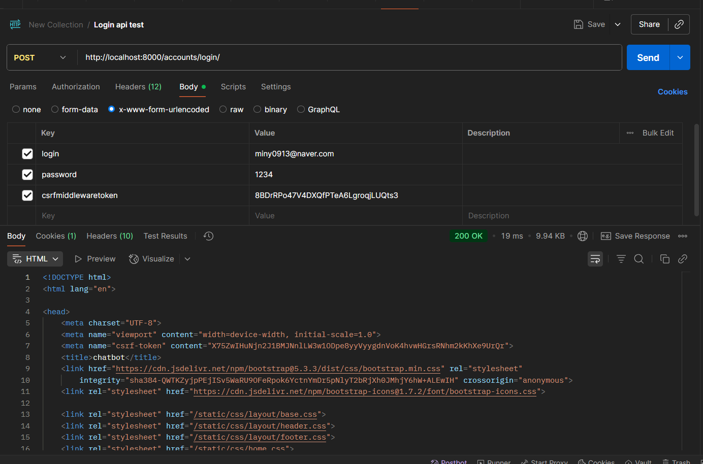
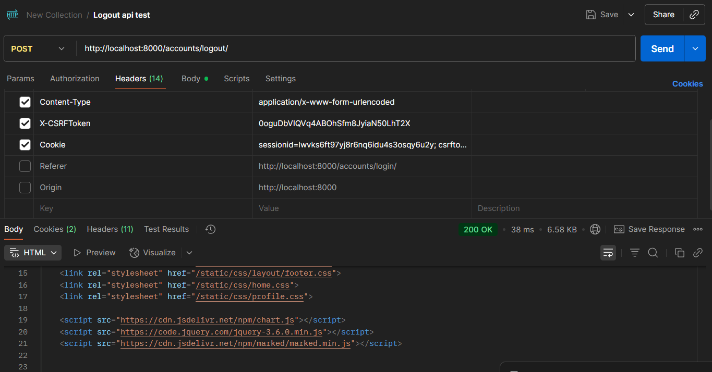
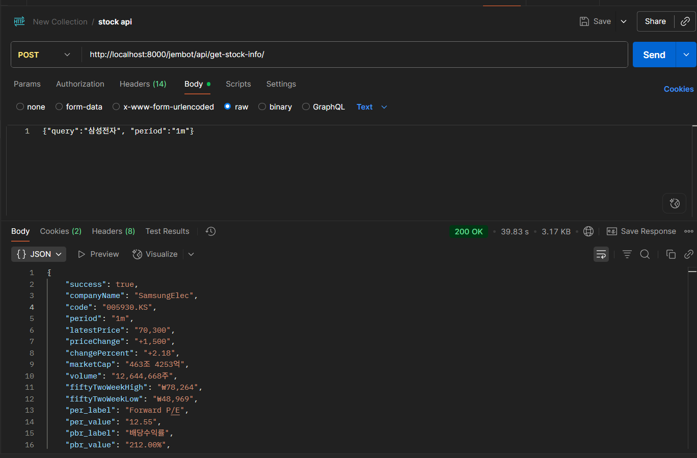
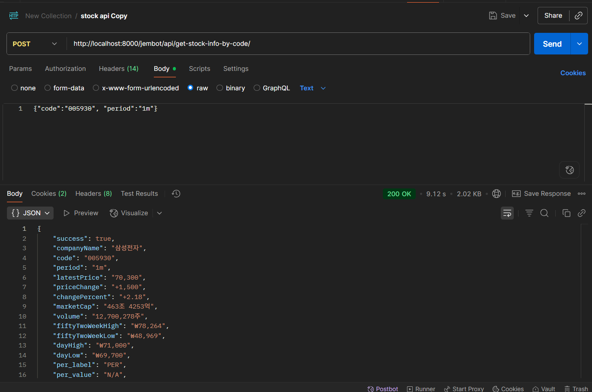
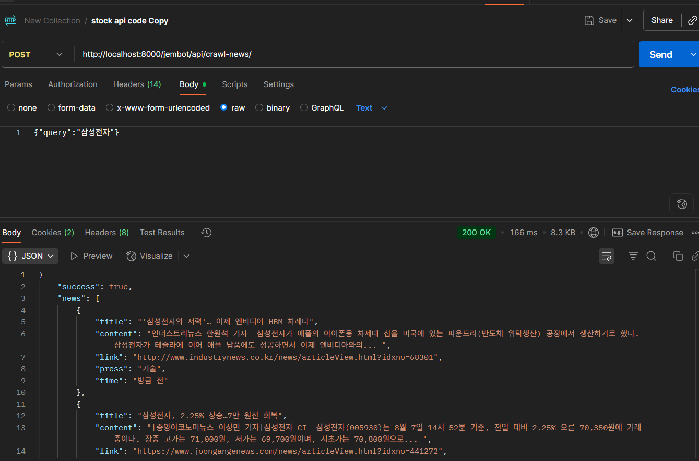
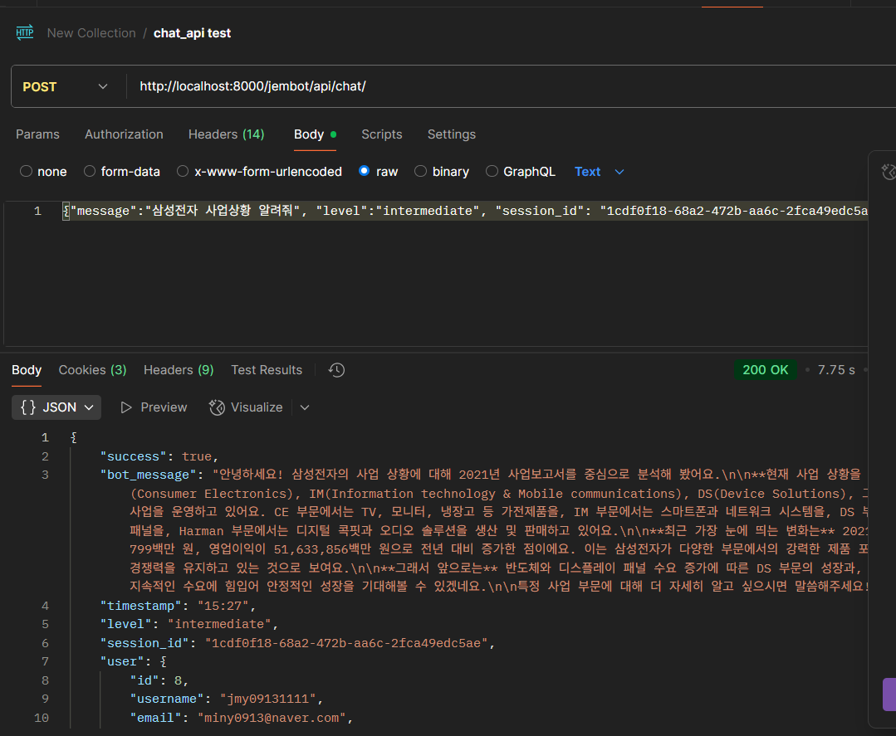
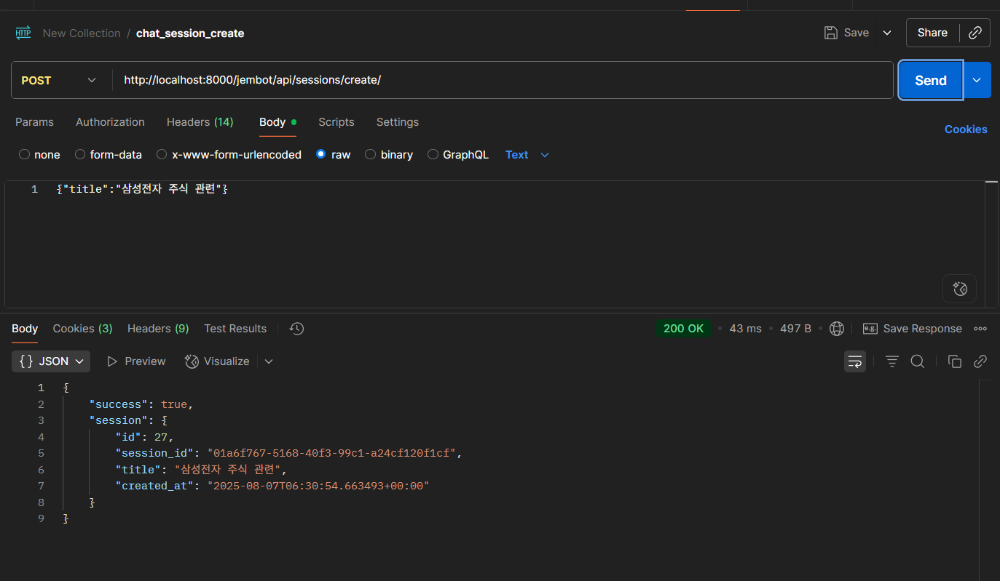
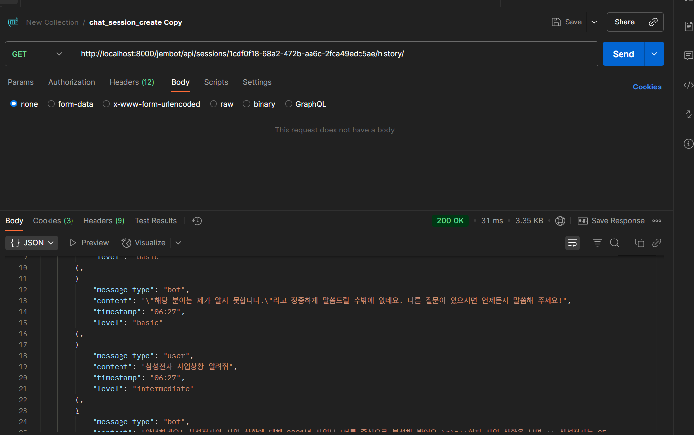
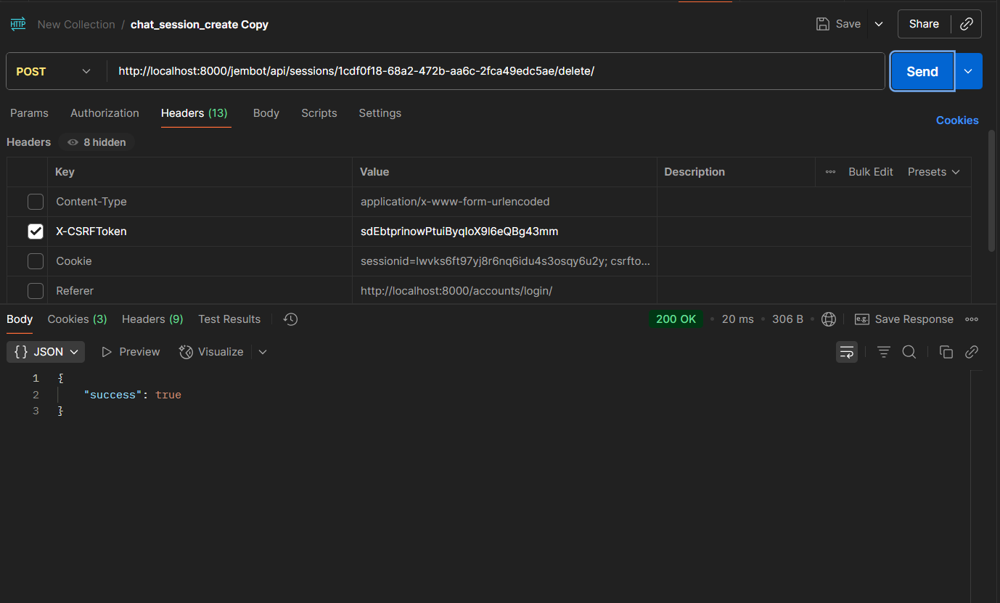

#  Jembot API 테스트 

## 목차
1. [인증 테스트](#인증-테스트)
2. [주식 정보 API 테스트](#주식-정보-api-테스트)
3. [챗봇 API 테스트](#챗봇-api-테스트)
4. [즐겨찾기 API 테스트](#즐겨찾기-api-테스트)
5. [댓글 API 테스트](#댓글-api-테스트)
6. [테스트 시나리오](#테스트-시나리오)

---

## �� 인증 테스트

### 1. 로그인 테스트 (django-allauth에서 제공하는 인증)

```markdown
URL: http://localhost:8000/accounts/login/
Method: POST

Headers:
- Content-Type: application/x-www-form-urlencoded
- X-CSRFToken : {csrftoken}
- Cookie : sessionid={session_id}; csrftoken={csrftoken}

Body (x-www-form-urlencoded):
- login: {email}
- password: {password}
- csrfmiddlewaretoken: {csrftoken}
```
### **📷 응답 결과 : 200 OK** 



### 2. 로그아웃 테스트

```markdown
URL: http://localhost:8000/accounts/logout/
Method: POST

Headers:
- Content-Type: application/x-www-form-urlencoded
- X-CSRFToken : {csrftoken}
- Cookie : sessionid={session_id}; csrftoken={csrftoken}

Body (x-www-form-urlencoded):
- login: {email}
- password: {password}
- csrfmiddlewaretoken: {csrftoken}

```
### **📷 응답 결과 : 200 OK** 



## �� 주식 정보 API 테스트

### 1. 회사명으로 주식 정보 조회

```markdown
URL: http://localhost:8000/jembot/api/get-stock-info/
Method: POST
Headers:
- Content-Type: application/json
- X-CSRFToken: {{CSRF_TOKEN}}
Body (JSON RAW):
{
"company_name": "삼성전자"
}
  
Expected Response:
{
"success": true,
"data": {
"name": "삼성전자",
"code": "",
"price": "",
"change": "",
"change_percent": ""
}
}
```

### **📷 응답 결과 : 200 OK** 



### 2. 주식 코드로 정보 조회

```markdown
URL: http://localhost:8000/jembot/api/get-stock-info-by-code/

Method: POST

Headers:
Content-Type: application/json
X-CSRFToken: {{CSRF_TOKEN}}

Body (JSON RAW):
{
"code": "005930", "period":"1m"
}

Expected Response:
{
"success": true,
"주식 정보들": ...
}
}
```

### **📷 응답 결과 : 200 OK** 


### 3. 네이버 뉴스 크롤링

```markdown
URL: {{BASE_URL}}/jembot/api/crawl-news/
Method: POST
Headers:
Content-Type: application/json
X-CSRFToken: {{CSRF_TOKEN}}
Body (JSON):
{
"company_name": "삼성전자"
}
Expected Response:
{
"success": true,
"news": [
{
"title": "뉴스 제목",
"news" : [뉴스데이터..]
}
]
}
```

### **📷 응답 결과 : 200 OK** 


---

## �� 챗봇 API 테스트

### 1. 챗봇 대화

```markdown
URL: http://localhost:8000/jembot/api/chat/
Method: POST
Headers:
Content-Type: application/json
X-CSRFToken: {{CSRF_TOKEN}}
Body (JSON RAW):
{
"message": "삼성전자 주식에 대해 알려줘",
"session_id": {session_id},
"level":"basic",
"chat_histroy":"none"
}
```

### **📷 응답 결과 : 200 OK** 



### 2. 새 채팅 세션 생성

```markdown
URL: http://localhost:8000/jembot/api/sessions/create/
Method: POST
Headers:
Content-Type: application/json
X-CSRFToken: {{CSRF_TOKEN}}
Body (JSON):
{
"title": {title}
}
```

### **📷 응답 결과 : 200 OK**



### 4. 채팅 히스토리 조회

```markdown
URL: http://localhost:8000/jembot/api/sessions/{{session_id}}/history/
Method: GET
```

### **📷 응답 결과 : 200 OK**



### 5. 채팅 세션 삭제

```markdown
URL: http://localhost:8000/jembot/api/sessions/{{session_id}}/delete/
Method: POST
Headers:
X-CSRFToken: {{CSRF_TOKEN}}
```

### **📷 응답 결과 : 200 OK**


---

## ⭐ 즐겨찾기 API 테스트

### 1. 즐겨찾기 추가

```markdown
URL: http://localhost:8000/jembot/api/favorites/add/
Method: POST
Headers:
Content-Type: application/json
X-CSRFToken: {{CSRF_TOKEN}}
Body (JSON):
{
"stock_code": "005930",
"stock_name": "삼성전자"
}
Expected Response:
{
"success": true,
"message": "즐겨찾기에 추가되었습니다."
}
```


### 2. 즐겨찾기 제거

```markdown
URL: {{BASE_URL}}/jembot/api/favorites/remove/
Method: POST
Headers:
Content-Type: application/json
X-CSRFToken: {{CSRF_TOKEN}}
Body (JSON):
{
"stock_code": "005930"
}
Expected Response:
{
"success": true,
"message": "즐겨찾기에서 제거되었습니다."
}

```


### 3. 즐겨찾기 목록 조회

```markdown
URL: {{BASE_URL}}/jembot/api/favorites/
Method: GET
Headers:
X-CSRFToken: {{CSRF_TOKEN}}
Expected Response:
{
"success": true,
"favorites": [
{
"stock_code": "005930",
"stock_name": "삼성전자",
"added_at": "2024-01-01T00:00:00Z"
}
]
}
```

### 4. 즐겨찾기 상태 확인

```
URL: {{BASE_URL}}/jembot/api/favorites/check/
Method: POST
Headers:
Content-Type: application/json
X-CSRFToken: {{CSRF_TOKEN}}
Body (JSON):
{
"stock_code": "005930"
}
Expected Response:
{
"success": true,
"is_favorite": true
}
```

### 5. 즐겨찾기 개수 조회

```markdown
URL: {{BASE_URL}}/jembot/api/favorites/count/
Method: POST
Headers:
Content-Type: application/json
X-CSRFToken: {{CSRF_TOKEN}}
Body (JSON):
{
"stock_code": "005930"
}
Expected Response:
{
"success": true,
"count": 5
}
```

---

## �� 댓글 API 테스트

### 1. 댓글 목록 조회


```markdown
URL: {{BASE_URL}}/jembot/api/reviews/
Method: POST
Headers:
Content-Type: application/json
X-CSRFToken: {{CSRF_TOKEN}}
Body (JSON):
{
"code": "005930"
}
Expected Response:
{
"success": true,
"reviews": [
{
"id": 1,
"content": "댓글 내용",
"user_nickname": "사용자명",
"profile_picture_url": "프로필 이미지 URL",
"created_at": "5분전",
"like_count": 3,
"is_liked": false,
"can_delete": true
}
],
"review_count": 1
}

```


### 2. 댓글 작성


```markdown
URL: {{BASE_URL}}/jembot/api/reviews/add/
Method: POST
Headers:
Content-Type: application/json
X-CSRFToken: {{CSRF_TOKEN}}
Body (JSON):
{
"code": "005930",
"content": "테스트 댓글입니다."
}
Expected Response:
{
"success": true,
"message": "댓글이 등록되었습니다.",
"review_id": 1
}
```

### 3. 댓글 삭제

```markdown
URL: {{BASE_URL}}/jembot/api/reviews/delete/
Method: POST
Headers:
Content-Type: application/json
X-CSRFToken: {{CSRF_TOKEN}}
Body (JSON):
{
"review_id": 1
}
Expected Response:
{
"success": true,
"message": "댓글이 삭제되었습니다."
}
```


### 4. 댓글 좋아요 토글


```markdown
URL: {{BASE_URL}}/jembot/api/reviews/like/
Method: POST
Headers:
Content-Type: application/json
X-CSRFToken: {{CSRF_TOKEN}}
Body (JSON):
{
"review_id": 1
}
Expected Response:
{
"success": true,
"is_liked": true,
"like_count": 4
}

```


---

## 📝 테스트 체크리스트

### ✅ 기능 테스트
- [ ] 모든 API 엔드포인트 정상 동작
- [ ] 응답 데이터 형식 검증
- [ ] 에러 처리 확인
- [ ] 인증/인가 검증

### ✅ 성능 테스트
- [ ] 응답 시간 측정
- [ ] 동시 요청 처리
- [ ] 대용량 데이터 처리

### ✅ 보안 테스트
- [ ] CSRF 토큰 검증
- [ ] 세션 관리 확인
- [ ] 권한 검증

### ✅ 사용성 테스트
- [ ] 사용자 인터페이스 테스트
- [ ] 브라우저 호환성 확인

---
