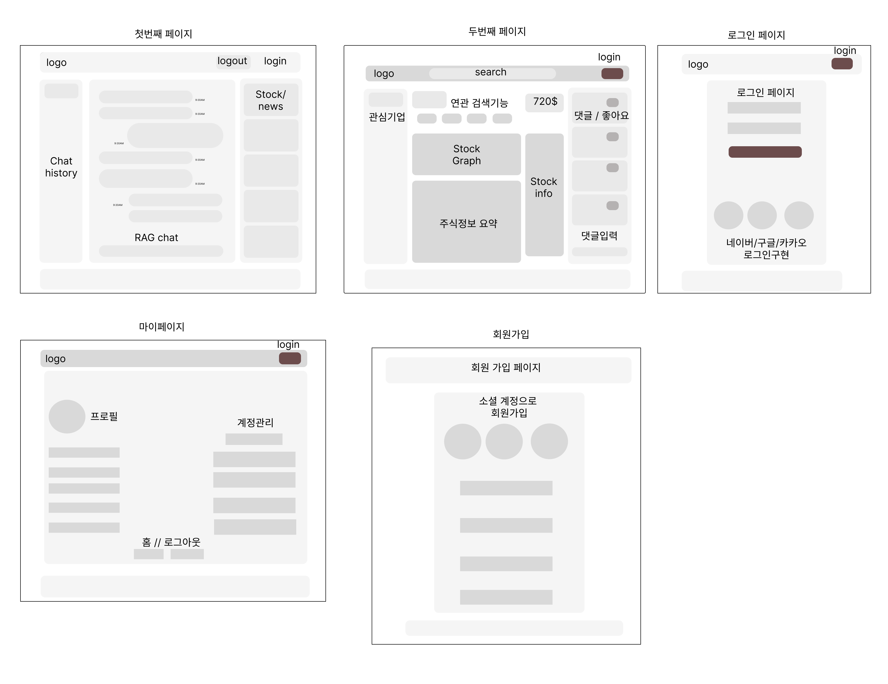
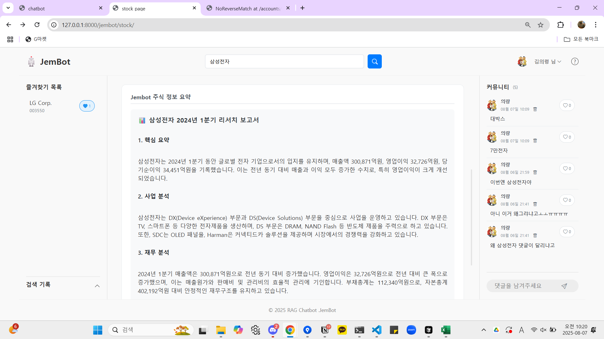
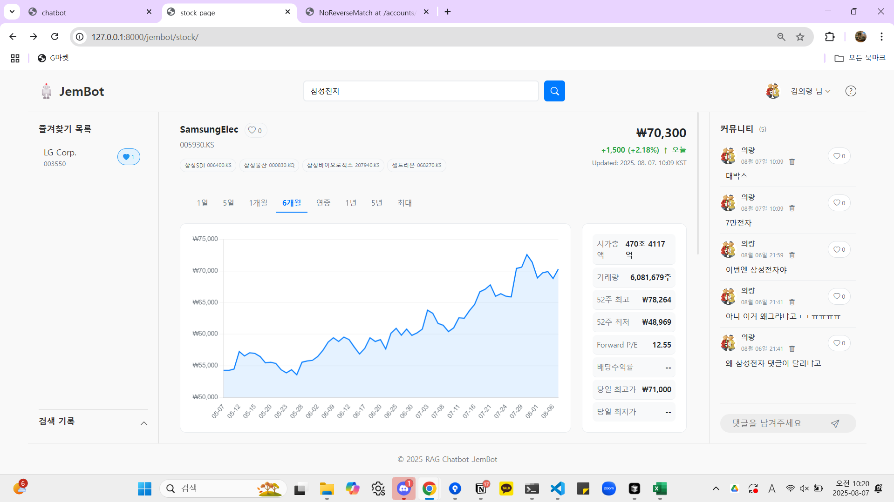
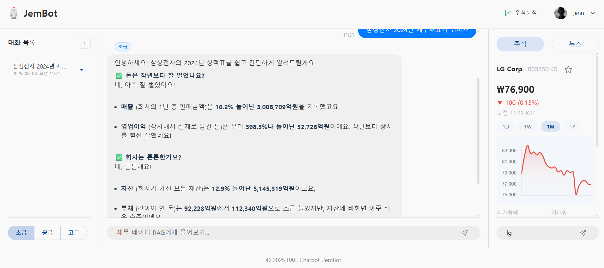
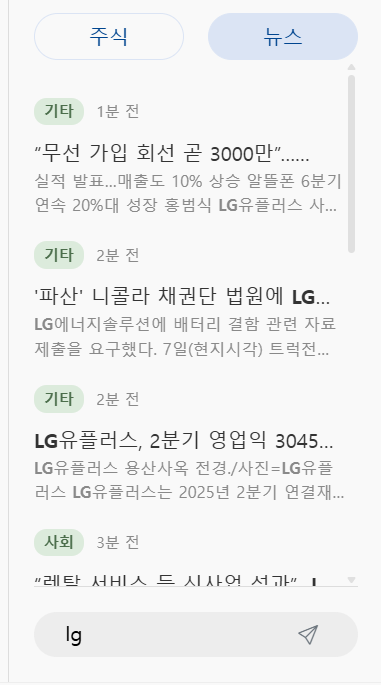
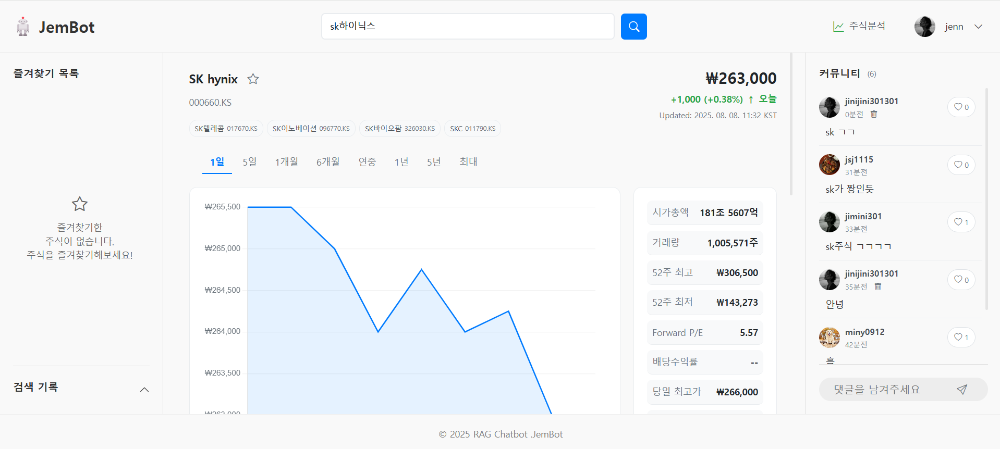
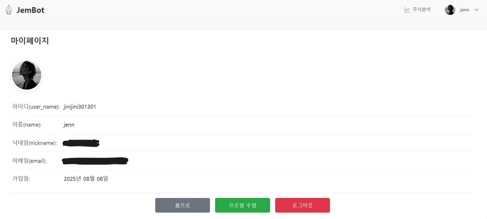
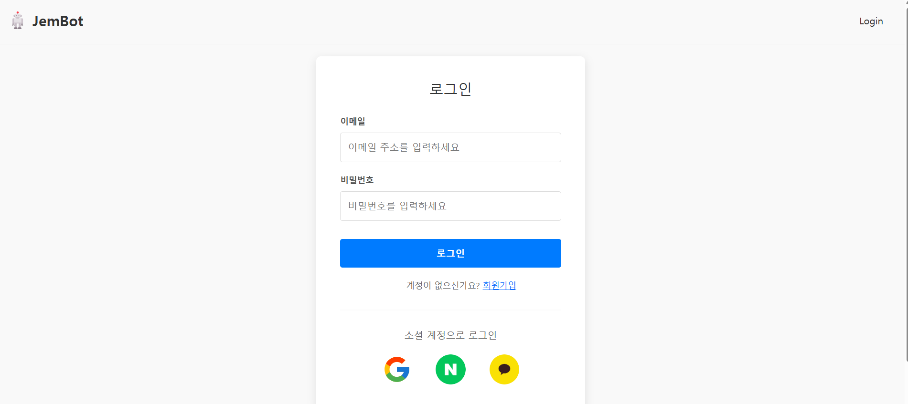

###### SKN14_4rd_2TEAM
# 주제 : 기업 정보 분석 및 요약 챗봇

## 프로젝트 소개  
특정 기업의 정보나 관련 소식을 알고 싶을 때 쉽게 찾을 수 있도록 도와주는 챗봇입니다.
LLM의 널리지 컷오프 특성상 최신정보를 알기어렵기때문에 최신재무재표를 기반으로
특정 기업의 상황이나 주식 , 뉴스등을 한번에 보여줄수있는 대시보드를 제작하였습니다.

## 1️⃣ 팀 소개
 ### 팀 명 : 젬봇
### 개발 기간
> 2025.08.07 ~ 2025.08.08
### 팀원

<table width="100%">
  <tr>
    <td align="center">
      
    </td>
    <td align="center">
      
    </td>
    <td align="center">
      
    </td>
    <td align="center">
      
    </td>
    <td align="center">
      
    </td>
    <td align="center">
      
    </td>
  </tr>
  <tr>
    <td align="center">
      <b><a href="https://github.com/">강윤구</a></b>
    </td>
    <td align="center">
      <b><a href="https://github.com/my-cookies-26">김의령</a></b>
    </td>
    <td align="center">
      <b><a href="https://github.com/iamkkr2030">김광령</a></b>
    </td>
    <td align="center">
      <b><a href="https://github.com/jinijini20">이원지희</a></b>
    </td>
    <td align="center">
      <b><a href="https://github.com/jmy0913">정민영</a></b>
    </td>
    <td align="center">
      <b><a href="https://github.com/jung33010">전정규</a></b>
    </td>
  </tr>
</table>

### 역할 분배
| 작업명          | 담당자       | 산출물          |
|:-------------|:----------|:-------------|
| 프로젝트 주제 선정   | 전체 팀원     |              |
| 로그인 기능 | 강윤구 , 김광령     |   RDB       |
| 랭그래프 개발        | 정민영       | 파이썬 파일,벡터DB     |
| Django 개발 | 정민영, 김의령  | html,css 파일 |
| README 작성    | 전정규      | README.md 파일 |
| ppt 제작       | 강윤구, 이원지희 | PPT          |
| 발표           | 강윤구       |              |

## 2️⃣ 프로젝트 개요
### 프로젝트 필요성

**1. 정보 접근성과 이해도 향상<br>**
- 기업의 사업보고서나 재무제표는 용어가 어렵고 구조가 복잡해 일반 투자자나 비전문가가 이해하기 힘든 경우가 많습니다. 
챗봇이 주요 내용인 매출 변화, 핵심 사업, 리스크 요소 등을 쉽게 풀어 설명해주면 누구나 빠르게 핵심 정보를 파악할 수 있어 
정보의 접근성과 이해도를 크게 높일 수 있습니다.

**2. 시간 절약 및 업무 효율화<br>**
- 수십~수백 페이지에 달하는 보고서를 직접 읽고 분석하는 데는 많은 시간이 소요됩니다. 챗봇을 활용하면 사용자가 필요한 부분만 
골라서 빠르게 확인할 수 있어 분석 시간과 수고를 줄일 수 있으며, 투자자, 회계사, 일반 사용자 모두에게 업무 효율 향상이라는 
이점을 제공합니다.

**3. 생성형 ai 사이트에서도 세부적인 사항은 알기 힘듭니다.<br>**
- 요즘 gpt나 gemini 같은 수많은 생성형 ai 사이트들이 있지만 이런 곳에서도 기업의 사업 보고서 같은 세부적인 내용은 알기 힘듭니다.
그렇기 때문에 환각 현상이 발생하여 원하는 정보를 얻지 못할 수 있습니다.

<hr>

### 프로젝트 목표

**1. 비전문가도 쉽게 이해할 수 있는 요약 제공**

- 어려운 용어나 구조를 쉽게 풀어, 누구나 핵심 내용을 빠르게 파악할 수 있도록 함.

**2. 사업보고서와 재무제표의 핵심 정보 자동 추출 및 요약**

- 매출, 영업이익, 주요 사업, 위험요소 등 주요 항목을 자동으로 분석하고 요약.

**3. 사용자 맞춤형 질문응답 기능 제공**

- “이 회사의 수익성은 어떤가요?”, “최근 3년 매출 추이는?”과 같은 질문에 맞춤형 답변 제공.

**4. 최신 공시 정보 실시간 반영 및 업데이트**

- DART api를 활용, 외부 데이터와 연동하여 최신 보고서 반영 가능.

**5. 웹 기반 챗봇 인터페이스 구현**

- 사용자가 PC에서 쉽게 접근할 수 있도록 직관적인 웹 챗봇 인터페이스 제공.

**6. 질문자가 원하는 수준에 따라 답변 수준 분류**

- 답변을 간단하고 쉽게 설명해주는 초급부터 구체적이고 전문적인 고급까지 답변 수준을
분류하여 설명

<hr>

## 3️⃣ 기술 스택 및 파일 구조
| 항목              | 내용                                                                                                                                                                                                                                                                                                         |
| :---------------- |:-----------------------------------------------------------------------------------------------------------------------------------------------------------------------------------------------------------------------------------------------------------------------------------------------------------|
| **Language** |     |
| **Development** |   |
| **Server** |  |
| **Deployment & Infra** |   |
| **Embedding** |  |
| **LLM Model** |  |
| **Collaboration Tool** |  |
| **Vector DB** |  |
| **API 활용** |  <br>  <br>  <br>   <br>  <br>  <br>|


<hr>

```markdown
jembot_all/
├── _homework/
│   ├── __pycache__/
│   ├── __init__.py
│   ├── asgi.py
│   ├── settings.py
│   ├── timeout_screenshot.png
│   ├── urls.py
│   ├── wsgi.py
│
├── accounts/
│   ├── __pycache__/
│   ├── adapter.py
│   ├── admin.py
│   ├── apps.py
│   ├── forms.py
│   ├── urls.py
│   ├── views.py
│
├── app/
├── images/
├── media/
│   └── profile_pics/
├── static/
│   ├── css/
│   │   ├── app/
│   │   │   ├── main.css
│   │   │   └── stock.css
│   │   ├── layout/
│   │   ├── home.css
│   │   └── profile.css
│   ├── images/
│   │   ├── google_icon.svg
│   │   ├── kakao_icon.png
│   │   ├── naver_icon.png
│   │   └── robot-icon.png
│   └── js/
│       └── app/
│           ├── main_chat.js
│           ├── main.js
│           └── stock.js
│
├── templates/
│   ├── account/
│   │   ├── login.html
│   │   ├── logout.html
│   │   ├── profile_edit.html
│   │   ├── profile.html
│   │   └── signup.html
│   ├── app/
│   │   ├── login.html
│   │   ├── main.html
│   │   └── stock.html
│   ├── layout/
│   │   ├── base.html
│   │   ├── footer.html
│   │   └── header.html
│   └── socialaccount/
│   └── home.html
│
├── .env
├── .gitignore
├── img.png
├── manage.py
├── requirements.txt
├── setup.sql


```
<hr>

## 4️⃣ 시스템 아키텍처


 **1. 질문 입력**<br>
**사용자는 챗봇을 통해 질문을 입력합니다.<br>**
- 예시:
“이 회사 최근 매출은 얼마나 늘었어?”
“현대자동차의 주력 사업이 뭐야?”
“2023년 말 기준 자산총계 알려줘”
이 입력은 그대로 LLM에게 넘기지 않고, **사전 처리 과정(분류 및 의도 파악)**을 거칩니다.


**2. 질문 유형 파악**<br>
**이 단계에서 질문이 어떤 유형인지 파악합니다.**
- 예시:
  - 사업정보 질문 (예: 주력 사업, 신사업, 시장 점유율 등)
  - 재무정보 질문 (예: 손익계산서, 재무상태표, 수익성 지표 등)
  - 일반정보 (예: 기업 개요, 설립일, 대표자 등)
  - 복합 정보 (두 가지 이상의 정보를 묻는 경우)
  - 그 외 질문 (기업과는 관련없는 질문)

**3. 적절한 데이터 소스 선택 및 검색**<br>
**질문 유형에 따라 다음과 같은 방식으로 데이터를 찾습니다.**
- 벡터 검색 : 사업보고서 같은 비정형 텍스트는 chunk 단위로 나눠 임베딩하고, FAISS 벡터 DB에 저장해 둡니다.


- DART API 활용 : 공시된 재무제표나 정형 데이터는 DART Open API를 통해 호출합니다.<br>
예시: "삼성전자 2023년 영업이익" → API를 호출하여 숫자 추출


- 혼합 접근 (Hybrid)
만약 질문이 복합적이면 벡터db 검색 + DART API 병행
<br>예시 : “작년 매출과 무슨 사업을 했는지 알려줘”

- 답변 생성 (LLM 기반 생성)
검색된 자료를 기반으로 LLM 모델이 답변을 생성합니다.<br>
예시 : “현대차는 2024년 대비 약 20% 매출이 증가하여, 2025년 총 140조 원의 매출을 기록했습니다.”

<hr>

##  5️⃣ 중요 코드 설명
#### 1. `api_get.py`

get_financial_state() 함수는 기업 코드, 연도, 보고서 코드, 연결 구분을 받아 DART API로 요청을 보냅니다.

응답이 성공적이면 각 항목(계정명, 당기/전기 금액, 통화)을 포맷팅해 리스트로 반환합니다.

오류 발생 시 [API 오류] 메시지를 포함한 리스트를 반환합니다.

---

#### 2. `chain_setting.py`

사용자가 선택한 기업명(selected_company)에 해당하는 고유 기업 코드(corp_code)를 CSV 파일에서 찾아냅니다.

해당 기업의 공시 보고서 목록을 DART Open API로 요청하여 JSON 형태로 받아옵니다.

받아온 보고서 리스트를 리스트 형태로 반환하며, 실패 시 빈 리스트를 반환합니다.

---

#### 3. `graph_node.py`
사용자의 질문을 분류(classify)하고 필요한 정보(회사, 연도 등)를 추출(extract_entities)합니다.

질문 유형과 난이도에 따라 적절한 체인(accounting, financial, business, hybrid 등)을 선택하여 문서 검색 및 답변을 생성합니다.

대화 기록(chat_history)을 유지하며 각 단계에서 사용자와 assistant의 역할에 따라 상태를 업데이트합니다.
---

#### 4. `normalize_code_search.py`
normalize_company_name()은 입력된 기업명을 정규화하여 corp_list에서 가장 유사한 공식 기업명으로 매칭합니다.

parse_extracted_text()는 텍스트에서 회사명과 연도 정보를 추출하여 딕셔너리 형태로 반환합니다.

find_corporation_code()는 정규화된 기업명을 기반으로 corp_list.json에서 해당 기업의 고유 코드를 찾아 반환합니다.
---

#### 5. `retriever_setting.py`
HuggingFace의 BAAI/bge-m3 임베딩 모델을 사용하여 로컬에 저장된 두 개의 FAISS 인덱스(faiss_index3, faiss_index_bge_m3)를 로드합니다.

각각의 인덱스에서 top-6 유사 문서를 검색할 수 있는 accounting_retriever와 business_retriever를 생성합니다.

SelfQueryRetriever 시도 코드는 주석 처리되어 있으며, 현재는 일반 retriever만 반환합니다
---

#### 6. `stock_price_tool.py`
yfinance 라이브러리를 사용하여 get_stock_price 함수를 만듭니다. 이 함수는 주식 티커(예: '005930.KS')를 입력받아 현재가, 등락률, 거래량 등 실시간 시세 정보를 조회하여 반환합니다. @tool 데코레이터로 감싸 LangGraph가 호출할 수 있는 명확한 기능 단위로 정의하는 것이 핵심입니다.
---

#### 7. `stock_news_retriever.py`
네이버 뉴스 검색 API나 웹 크롤링을 통해 특정 기업 관련 최신 뉴스 기사들을 수집하는 search_news 함수를 구현합니다. 수집된 뉴스 텍스트들을 임베딩 모델(예: bge-m3)로 벡터화하고 FAISS 같은 벡터 DB에 저장하여, 사용자의 질문과 가장 관련 높은 뉴스 내용을 RAG(Retrieval-Augmented Generation) 방식으로 찾아내는 검색기(Retriever) 역할을 수행합니다.
---

#### 8. `agent_state.py` 
TypedDict를 사용하여 에이전트의 작업 내용을 기록할 '상태'의 형식을 정의합니다. 사용자의 원본 질문(question)과 함께, 위 stock_price_tool의 결과가 담길 stock_price 필드, stock_news_retriever가 찾아온 뉴스가 담길 related_news 필드 등을 명시합니다. 이 상태는 모든 노드에 전달되는 중앙 데이터 버스입니다.
---

#### 9. `graph_router.py` 
에이전트의 '상태'를 보고 다음 행동을 결정하는 '라우터(Router)' 함수를 작성합니다. 예를 들어, 상태에 related_news는 있지만 stock_price 정보가 없다면 '시세 조회 도구' 노드를 호출하라고 지시합니다. 모든 정보가 준비되면 '최종 답변 생성' 노드로 보내는 등, **조건부 엣지(conditional edge)**의 핵심 두뇌 역할을 담당합니다.

### 흐름
## 1. 사용자 인증 흐름 (일반 로그인 및 소셜 로그인)

### 🔐 소셜 로그인 흐름:

```
사용자
    ↓
Django 서버 (소셜 로그인 버튼 클릭)
    ↓
소셜 로그인 API (Google/Kakao/Naver) - 외부 사이트로 리디렉션
    ↓
사용자 인증 완료 후 Django로 콜백
    ↓
Django Allauth가 인증 코드 처리 & 사용자 정보 가져오기
    ↓
세션 생성
    ↓
사용자 대시보드
```

---

### 🔑 일반 로그인 흐름 (이메일/비밀번호):

```
사용자 (이메일/비밀번호 입력)
    ↓
Django Allauth 인증 (DB에서 이메일/비밀번호 확인)
    ↓
세션 생성
    ↓
사용자 대시보드
```
## 2. 챗봇 답변 흐름

```
사용자 질문
     ↓
Django 서버 (웹 인터페이스)
     ↓
LangGraph
     ↓ (질문 분류 & 회사명/연도 추출)
OpenAI GPT-4o (분류/추출 작업)
     ↓
병렬 처리:
   ├── FAISS 벡터 DB (회계기준서/사업보고서 검색)
   └── DART Open API (실시간 재무제표 조회)
     ↓
수집된 모든 데이터 + 프롬프트
     ↓
OpenAI GPT-4o (최종 답변 생성)
     ↓
Django 서버
     ↓
챗봇 응답
```
## 3. 주식 정보 요청 흐름(주식검색)

```
사용자 주식 검색
    ↓
Django 서버
    ↓
yfinance / pykrx (주식 데이터 조회)
    ↓
데이터 가공 및 포맷팅
    ↓
사용자에게 결과 제공
```
## 4. 뉴스 정보 요청 흐름
```
사용자 요청
    ↓
Django 서버
    ↓
네이버 뉴스 Open API (또는 크롤링)
    ↓
Beautiful Soup (HTML 파싱/데이터 정제)
    ↓
뉴스 정보 제공
```

## 5 주식 리포트 제공 흐름
```
사용자 요청 (기업명)
    ↓
Django 서버
    ↓
LangGraph 워크플로우 실행
    ↓
FAISS 벡터 DB (사업보고서) + DART API (재무제표)
    ↓
OpenAI GPT-4o (분석 리포트 생성)
    ↓
주식 분석 리포트 제공
```

## 6️⃣ Django WEBAPP 구현

**화면설계 와이어 프레임**
  


- **결과**<br>
  <br>
  <br>
  <br>


### 추가 구현 사항
#### 1. 채팅창 옆에 뉴스와 주식을 볼 수 있는 칸을 구현하여 기업에 관한 정보를 쉽게 얻을 수 있도록 구현
<br>
<br>
- 밑의 입력창에 기업명을 적으면 그 기업과 관련된 기사들이 뜨는 식으로 구현했습니다.
- 주식 칸에서 기업명을 검색하면 그 기업의 주가 정보가 나오도록 구현했습니다.

#### 2. 관심기업 및 종합보고서 기능 그리고 주식조회와 왼쪽의 댓글코멘트와 좋아요의 기능을 추가
<br>
- 해당 주식에 대한 여러 사람들의 생각을 볼 수 있게 댓글창을 구현하였으며 거기다 댓글에 좋아요를 눌러 서로 교류할 수 있도록 하였습니다.

#### 3. 마이페이지와 회원가입 기능 추가
<br> 
<br> 
- 로그인 및 로그인한 회원의 정보와 그 정보를 수정할 수 있는 기능을 추가하였습니다.

<hr>

## 7️⃣ 성능 개선 노력
- **벡터db와 api 동시 사용**

  - 저희 챗봇은 정적 데이터 검색을 위한 벡터 DB와 동적 정보 조회를 위한 실시간 API를 
  결합한 하이브리드 검색 구조를 구현했습니다. 이 접근법은 벡터 DB에 모든 데이터를 
  저장하는 것의 현실적인 제약을 극복하고, 내장 데이터만으로는 답변할 수 없는 최신 정보나 
  외부 데이터 기반의 질문에 효과적으로 대응할 수 있습니다.
  
 
- **질문 유형 다양화**
  - 사용자 질문의 복잡성과 다양성에 대응하기 위해, 질문의 의도를 5가지 유형으로 먼저 
  분류하는 의도 분류 단계를 도입했습니다. 분류된 유형에 따라
  각기 다른 전문 체인과 리트리버가 동적으로 선택되어 질문을 처리합니다. 이러한 멀티-체인 
  아키텍처는 단일 파이프라인 방식보다 훨씬 더 정교하고 맥락에 맞는 답변을 생성하여 응답의 
  전문성을 극대화합니다.


- **Langgraph 활용**
  - LangGraph를 활용해 질문 분류, 정보 추출, 응답 생성을 단계별 노드로 나누고, 조건 분기로 흐름을 자동 제어하도록 구성했습니다.
  이 구조를 통해 복잡한 질문도 유연하게 처리할 수 있고, 각 질문에 맞는 적절한 응답 체인을 선택해 정확도를 높였습니다.
  또한 유지보수가 쉬워지고, 사용자 수준별(초급~고급) 대응도 가능해져 전반적인 성능이 향상되었습니다.

<hr>


## 한 줄 회고
- 전정규:기존 streamlit과 다르게 django로 새롭게 구현하는게 신기하고 어려웠습니다. 이번프로젝트 팀원들 모두 고생많으셨습니다. 
- 이원지희: Django로 웹을 구현 시도 해보고  Langrpah를 연동하며, 그과정에서 발생한 문제를 해결하며 많은것을 배웠습니다.
- 김광령:django를 활용하여 웹 페이지를 실제로 구현하는 게 힘들긴 했지만 좋은 경험이었습니다.
- 정민영:LangGraph 구조 설계와 Django 웹 페이지 구현을 통해 수많은 오류를 해결하며, 문제 해결 능력과 기술적 깊이를 쌓은 값진 경험이었습니다.
- 김의령:Django에 맞게 HTML, CSS, JavaScript 구조를 설계하고, RAG와 연동을 구현하는 과정에서 중간중간 많은 어려움이 있었지만, 원하는 결과물을 도출해낼 수 있었어서 뜻깊은 시간이었습니다.
- 강윤구:장고의 백엔드 흐름과 작동 원리를 전체적으로 이해하는 시간이었다
