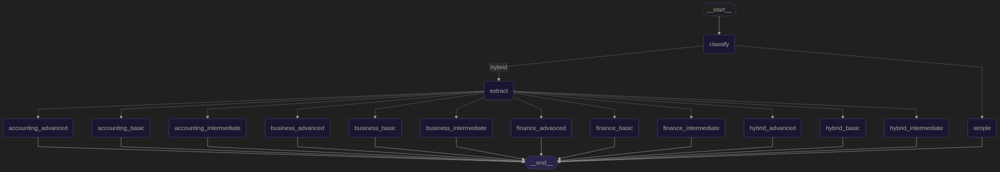
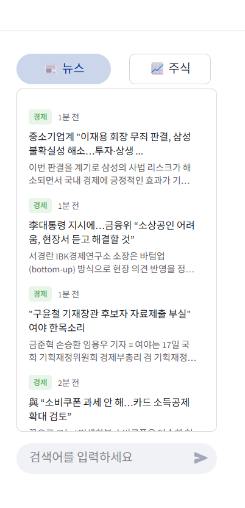
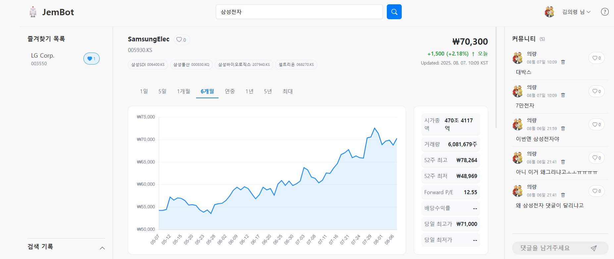

###### SKN14_3rd_2TEAM
# 주제 : 기업 정보 분석 및 요약 챗봇

## 프로젝트 소개  
특정 기업의 정보나 관련 소식을 알고 싶을 때 쉽게 찾을 수 있도록 도와주는 챗봇입니다.
LLM의 널리지 컷오프 특성상 최신정보를 알기어렵기때문에 최신재무재표를 기반으로
특정 기업의 상황이나 주식 , 뉴스등을 한번에 보여줄수있는 대시보드를 제작하였습니다.

## 1️⃣ 팀 소개
 ### 팀 명 : 젬봇
### 개발 기간
> 2025.08.07 ~ 2025.08.08
### 팀원

<table width="100%">
  <tr>
    <td align="center">
      
    </td>
    <td align="center">
      
    </td>
    <td align="center">
      
    </td>
    <td align="center">
      
    </td>
    <td align="center">
      
    </td>
    <td align="center">
      
    </td>
  </tr>
  <tr>
    <td align="center">
      <b><a href="https://github.com/">강윤구</a></b>
    </td>
    <td align="center">
      <b><a href="https://github.com/my-cookies-26">김의령</a></b>
    </td>
    <td align="center">
      <b><a href="https://github.com/iamkkr2030">김광령</a></b>
    </td>
    <td align="center">
      <b><a href="https://github.com/jinijini20">이원지희</a></b>
    </td>
    <td align="center">
      <b><a href="https://github.com/jmy0913">정민영</a></b>
    </td>
    <td align="center">
      <b><a href="https://github.com/jung33010">전정규</a></b>
    </td>
  </tr>
</table>

### 역할 분배
| 작업명          | 담당자       | 산출물          |
|:-------------|:----------|:-------------|
| 프로젝트 주제 선정   | 전체 팀원     |              |
| 로그인 기능 | 강윤구 , 김광령     | CSV 파일,벡터DB, RDB       |
| 랭그래프 개발        | 정민영       | 파이썬 파일       |
| Django 개발 | 전체팀원  | Streamlit 파일 |
| README 작성    | 전정규      | README.md 파일 |
| ppt 제작       | 강윤구, 이원지희 | PPT          |
| 발표           | 강윤구       |              |

## 2️⃣ 프로젝트 개요
### 프로젝트 필요성

**1. 정보 접근성과 이해도 향상<br>**
- 기업의 사업보고서나 재무제표는 용어가 어렵고 구조가 복잡해 일반 투자자나 비전문가가 이해하기 힘든 경우가 많습니다. 
챗봇이 주요 내용인 매출 변화, 핵심 사업, 리스크 요소 등을 쉽게 풀어 설명해주면 누구나 빠르게 핵심 정보를 파악할 수 있어 
정보의 접근성과 이해도를 크게 높일 수 있습니다.

**2. 시간 절약 및 업무 효율화<br>**
- 수십~수백 페이지에 달하는 보고서를 직접 읽고 분석하는 데는 많은 시간이 소요됩니다. 챗봇을 활용하면 사용자가 필요한 부분만 
골라서 빠르게 확인할 수 있어 분석 시간과 수고를 줄일 수 있으며, 투자자, 회계사, 일반 사용자 모두에게 업무 효율 향상이라는 
이점을 제공합니다.

**3. 생성형 ai 사이트에서도 세부적인 사항은 알기 힘듭니다.<br>**
- 요즘 gpt나 gemini 같은 수많은 생성형 ai 사이트들이 있지만 이런 곳에서도 기업의 사업 보고서 같은 세부적인 내용은 알기 힘듭니다.
그렇기 때문에 환각 현상이 발생하여 원하는 정보를 얻지 못할 수 있습니다.

<hr>

### 프로젝트 목표

**1. 비전문가도 쉽게 이해할 수 있는 요약 제공**

- 어려운 용어나 구조를 쉽게 풀어, 누구나 핵심 내용을 빠르게 파악할 수 있도록 함.

**2. 사업보고서와 재무제표의 핵심 정보 자동 추출 및 요약**

- 매출, 영업이익, 주요 사업, 위험요소 등 주요 항목을 자동으로 분석하고 요약.

**3. 사용자 맞춤형 질문응답 기능 제공**

- “이 회사의 수익성은 어떤가요?”, “최근 3년 매출 추이는?”과 같은 질문에 맞춤형 답변 제공.

**4. 최신 공시 정보 실시간 반영 및 업데이트**

- DART api를 활용, 외부 데이터와 연동하여 최신 보고서 반영 가능.

**5. 웹 기반 챗봇 인터페이스 구현**

- 사용자가 PC에서 쉽게 접근할 수 있도록 직관적인 웹 챗봇 인터페이스 제공.

**6. 질문자가 원하는 수준에 따라 답변 수준 분류**

- 답변을 간단하고 쉽게 설명해주는 초급부터 구체적이고 전문적인 고급까지 답변 수준을
분류하여 설명

<hr>

## 3️⃣ 기술 스택 및 파일 구조
| 항목 | 내용                                                                                                                                                                                                                                                                                                       |
| :--- |:---------------------------------------------------------------------------------------------------------------------------------------------------------------------------------------------------------------------------------------------------------------------------------------------------------|
| **Language** |    |
| **Development** |                                                                             |
| **Embedding** |                                                                                                                                                                                     |
| **LLM Model** |                                                                                                                                                                                     |
| **Collaboration Tool** |                                                                                                                                                                                                              |
| **Vector DB** |                                                                                          |
| **API 활용** |                                                                                                                                                                                               |
<hr>

```markdown
SKN14-3rd-2Team/
└── 📁 JeonJungKyu/
    └── 📁 test-nt2/
        ├── 📁 icon/                     # 아이콘 등 UI 리소스 저장소
        │
        ├── 📁 utils1/                  # 핵심 로직 및 유틸리티 패키지
        │   ├── 📁 faiss_index3/        # FAISS 벡터 인덱스 저장소 1
        │   ├── 📁 faiss_index_bge_m3/   # FAISS 벡터 인덱스 저장소 2 (bge-m3 모델 기반)
        │   ├── __init__.py           
        │   ├── api_get.py            # 외부 API 키를 안전하게 불러오는 함수
        │   ├── chain_setting.py      # LangChain/LangGraph 체인 및 프롬프트 설정
        │   ├── corp_list.json        # 기업 코드 목록 (JSON 데이터)
        │   ├── handle_node.py        # LangGraph의 각 노드(Node) 로직 정의
        │   ├── main.py               # 전체 RAG 흐름을 제어하는 메인 컨트롤러
        │   ├── normalize_code_search.py # 기업명/코드 검색 및 정규화
        │   └── retreiver_setting.py  # Retriever 객체 생성 및 설정
        │
        └── ffinal.py                   # Streamlit 웹 애플리케이션 실행 파일
```
<hr>

## 4️⃣ 시스템 아키텍처



 **1. 질문 입력**<br>
**사용자는 챗봇을 통해 질문을 입력합니다.<br>**
- 예시:
“이 회사 최근 매출은 얼마나 늘었어?”
“현대자동차의 주력 사업이 뭐야?”
“2023년 말 기준 자산총계 알려줘”
이 입력은 그대로 LLM에게 넘기지 않고, **사전 처리 과정(분류 및 의도 파악)**을 거칩니다.


**2. 질문 유형 파악**<br>
**이 단계에서 질문이 어떤 유형인지 파악합니다.**
- 예시:
  - 사업정보 질문 (예: 주력 사업, 신사업, 시장 점유율 등)
  - 재무정보 질문 (예: 손익계산서, 재무상태표, 수익성 지표 등)
  - 일반정보 (예: 기업 개요, 설립일, 대표자 등)
  - 복합 정보 (두 가지 이상의 정보를 묻는 경우)
  - 그 외 질문 (기업과는 관련없는 질문)

**3. 적절한 데이터 소스 선택 및 검색**<br>
**질문 유형에 따라 다음과 같은 방식으로 데이터를 찾습니다.**
- 벡터 검색 : 사업보고서 같은 비정형 텍스트는 chunk 단위로 나눠 임베딩하고, Pinecone 또는 FAISS 같은 벡터 DB에 저장해 둡니다.


- DART API 활용 : 공시된 재무제표나 정형 데이터는 DART Open API를 통해 호출합니다.<br>
예시: "삼성전자 2023년 영업이익" → API를 호출하여 숫자 추출


- 혼합 접근 (Hybrid)
만약 질문이 복합적이면 벡터db 검색 + DART API 병행
<br>예시 : “작년 매출과 무슨 사업을 했는지 알려줘”

- 답변 생성 (LLM 기반 생성)
검색된 자료를 기반으로 LLM 모델이 답변을 생성합니다.<br>
예시 : “현대차는 2024년 대비 약 20% 매출이 증가하여, 2025년 총 140조 원의 매출을 기록했습니다.”

<hr>

##  5️⃣ 중요 코드 설명
#### 1. `api_get.py`
- `get_financial_state(corp_code, bsns_year, reprt_code, fs_div)`: DART 서버에 접속해 특정 회사의 해당 연도 재무제표 데이터를 API로 요청하고, 
그 결과를 사람이 읽기 좋은 문자열 리스트로 가공하여 반환합니다.
- **파일 요약**: 외부 금융감독원(DART) 서버와 통신하여 실시간 재무제표 데이터를 가져오는 역할을 담당합니다.
성공 시 가공된 데이터를, 실패 시 에러 메시지를 반환합니다.

---

#### 2. `chain_setting.py`
- `create_chain()`: `gpt-4o-mini` 모델을 기반으로, 다양한 목적(질문 분류, 답변 생성 등)을 가진 프롬프트와
모델을 결합하여 여러 종류의 LangChain '체인'을 생성하고 반환합니다.
- **파일 요약**: AI 언어 모델(LLM)과의 모든 상호작용 규칙을 정의하는 파일입니다. 다양한 프롬프트와 LLM을 
결합해, 특정 작업에 최적화된 처리 파이프라인인 '체인'들을 만듭니다.

---

#### 3. `handle_node.py`
- `handle_accounting(question)`: 회계 기준서 데이터베이스에서 질문과 관련된 내용을 검색해 답변을 생성합니다.
- `handle_business(question)`: 사업보고서 데이터베이스에서 질문과 관련된 내용을 검색해 답변을 생성합니다.
- `handle_financial(question)`: 질문에서 회사명과 연도를 추출하고, DART API로 재무 데이터를 조회해 
답변을 생성합니다.
- `handle_hybrid(question)`: 위 세 가지 작업을 모두 수행하여 API 데이터와 내부 검색 결과를 종합한 
심층 분석 답변을 생성합니다.
- `elief(question)`: 회계와 관련 없는 일반적인 질문을 처리합니다.
- **파일 요약**: 분류된 질문 유형에 따라 실제 작업을 지휘하는 '핸들러' 함수 모음입니다. 각 함수는 데이터 
검색, API 호출 등 필요한 작업을 수행하고, 수집된 모든 정보를 적절한 '체인'에 넘겨 최종 답변을 생성하는 처리 
허브입니다.

---

#### 4. `normalize_code_search.py`
- `normalize_company_name(user_input, corp_list)`: 사용자가 입력한 회사명을 표준 회사명으로 정규화합니다.
- `parse_extracted_text(text)`: AI가 생성한 텍스트에서 회사명과 연도를 정확히 추출합니다.
- `find_corporation_code(company_name)`: 정규화된 회사명을 바탕으로 DART API에서 사용할 고유 기업 코드를 찾아 반환합니다.
- **파일 요약**: 사용자 입력을 시스템이 이해하기 쉬운 형태로 가공하는 유틸리티 파일입니다. 비정형적인 회사명을 표준화하고, 텍스트에서 특정 정보를 추출하며, 최종적으로 DART 기업 코드를 찾아주는 역할을 합니다.

---

#### 5. `retriever_setting.py`
- `faiss_retriever_loading()`: 미리 구축된 두 종류의 FAISS 벡터 데이터베이스(회계 기준서, 사업보고서)를 로드하고, `BAAI/bge-m3` 임베딩 모델을 기반으로 문서 내용을 검색할 수 있는 '리트리버' 객체들을 생성합니다.
- **파일 요약**: 정보 검색 시스템을 설정하는 파일입니다. 저장된 문서 데이터베이스를 불러와, 사용자의 질문 의도와 가장 관련성 높은 문서를 효율적으로 찾아주는 '리트리버'를 준비하는 역할을 합니다.

### 흐름

**"삼성전자 2024년 실적이 어때" 질문 처리 순서**<br>
1. 유형 분류: chain_setting.py의 classification_chain이 질문을 'finance' 유형으로
분류하고, handle_node.py의 handle_financial 함수를 호출합니다.


2. 정보 추출: chain_setting.py의 extract_chain이 질문에서 '삼성전자'와 '2024년'을 추출합니다.


3. 코드 변환: normalize_code_search.py의 find_corporation_code 함수가 '삼성전자'를 
DART에서 사용하는 고유 기업 코드로 변환합니다.


4. 데이터 조회: api_get.py의 get_financial_state 함수가 기업 코드와 연도를 이용해 
DART 서버에서 실시간 재무제표 데이터를 조회합니다.


5. 답변 생성: chain_setting.py의 financial_chain이 조회된 실제 데이터를 바탕으로 
최종 실적 분석 답변을 생성하여 사용자에게 보여줍니다.

## 6️⃣ 스트림릿 구현

**메인 페이지**
  


### 테스트 진행

- **테스트 목적**  
  챗봇이 질문에 맞는 대답을 찾지 못하거나 환각 현상이 일어남을 방지하기 위함.


- **테스트 환경**  
  - LLM: GPT-4o-mini (OpenAI API)  
  - 벡터 DB: pinecone,Faiss  
  - 외부 API: Open Dart API


- **결과**<br>
  <br>
  <br> 


### 추가 구현 사항
**채팅창 옆에 뉴스와 주식을 볼 수 있는 칸을 구현하여 기업에 관한 정보를 많이 습득할 수 있도록 하였습니다.**
#### 1. 뉴스
<br>
- 밑의 입력창에 기업명을 적으면 그 기업과 관련된 기사들이 뜨게 되며 이를 바탕으로 그 기업에
대해 보다 잘 알 수 있게 구현했습니다.

#### 2. 주식
<br>
- 투자에 관심이 있으신 분들을 위해 기업 관련 주식이 나오는 칸을 만들어 보다 찾아보기
쉽게 구현했습니다.

<hr>

## 7️⃣ 성능 개선 노력
- **벡터db와 api 동시 사용**

  - 저희 챗봇은 정적 데이터 검색을 위한 벡터 DB와 동적 정보 조회를 위한 실시간 API를 
  결합한 하이브리드 검색 구조를 구현했습니다. 이 접근법은 벡터 DB에 모든 데이터를 
  저장하는 것의 현실적인 제약을 극복하고, 내장 데이터만으로는 답변할 수 없는 최신 정보나 
  외부 데이터 기반의 질문에 효과적으로 대응할 수 있습니다.
  
 
- **질문 유형 다양화**

  - 사용자 질문의 복잡성과 다양성에 대응하기 위해, 질문의 의도를 5가지 유형으로 먼저 
  분류하는 의도 분류 단계를 도입했습니다. 분류된 유형에 따라
  각기 다른 전문 체인과 리트리버가 동적으로 선택되어 질문을 처리합니다. 이러한 멀티-체인 
  아키텍처는 단일 파이프라인 방식보다 훨씬 더 정교하고 맥락에 맞는 답변을 생성하여 응답의 
  전문성을 극대화합니다.
  

- **메타 데이터 사용** 
  
  - 답변의 속도와 정확도를 향상시키기 위해 벡터 데이터에 날짜, 회사명 등의 메타 데이터를 
  결합했습니다. 벡터 유사도 검색을 수행하기 전, 이 메타 데이터를 기준으로 사전 필터링을 
  적용하여 검색해야 될 양을 줄였습니다. 이 방식은 관련 없는 데이터를 미리 제외함으로써
  검색 속도를 높이고, 문맥에 더 적합한 결과를 찾아내어 최종 답변의 정확도를 높였습니다.

<hr>


## 한 줄 회고
- 강윤구 : rag기반 챗봇을 구현해보면서 데이터 수집 > 임베딩 > 벡터DB > 리트리버 > llm 의 구조를 확인해보고 세부 기법까지 써보는 좋은 경험이었다.
- 김의령 : 수업시간에 배운 RAG와 LLM을 직접 실습해보면서 개념을 더 익힐 수 있어 유익했다. 챗봇까지 만들어볼 수 있어서 뿌듯한 시간이었던것 같다.
- 김광령 : langchain과 RAG를 활용하여 챗봇을 만드는 과정이 어렵긴 했지만 그 덕에 많은 공부가 된 거 같다.
- 정민영 : RAG 채팅 모델을 구현하며, 단순 API 연동을 넘어 검색-생성의 전 과정을 주도적으로 설계한 값진 경험이었다.
- 이원지희 : 이번프로젝트를통해 RAG구현 흐름을 배웠던건데 프로젝트하면서 더 확실히 흐름이나 코드를 찾아보고 공부하면서 유익했던 시간이었습니다.
- 전정규 : RAG시스템을 구현함으로써 LLM어플리케이션을 더 잘 이해할수있는 계기가 되었습니다. 팀원분들모두 고생많으셨습니다
